## Benchmark Results: MCP Server vs azmcp CLI — Dependency Analysis & Key Vault Impact

**Run date:** 2026-04-23 08:50  
**Target:** `rg-dev-eastus` in subscription `githubcopilotforazure-testing`  
**azmcp version:** 3.0.0-beta.3  
**CLI parameter reference:** [Azure MCP Server tools](https://learn.microsoft.com/en-us/azure/developer/azure-mcp-server/tools/)

**Prompt:**
> What are all the dependency relationships between resources in rg-dev-eastus? If I deleted each Key Vault, what would break? Show me a dependency graph.

---

## Summary Comparison

| Metric | Session A (MCP Server) | Session B (azmcp CLI) |
|--------|------------------------|----------------------|
| **Total time** | 179.2s | 278.0s |
| **Tool/CLI calls** | 13 | 13 |
| **Total output bytes** | 129,169 | 245,573 |
| **JSON payload bytes** | 129,169 (pure JSON via SSE) | 133,321 |
| **Log overhead bytes** | 0 | 107,517 (43.8% of output) |
| **Estimated tokens (total output)** | ~32,292 | ~61,393 |
| **Estimated tokens (JSON only)** | ~32,292 | ~33,330 |
| **Key Vaults found** | 2 | 2 |
| **Resources enumerated** | 35 | 35 |

> **Key insight:** The JSON payloads are nearly identical in size (~32K vs ~33K tokens).
> The MCP Server delivers **only** JSON via SSE, while the CLI mixes `info:` HTTP logging
> into **stdout** (not stderr), inflating total output to ~61K tokens. An agent consuming
> raw CLI stdout without filtering would ingest **90% more tokens** than via MCP Server.
> Wall-clock time is also 55% slower for CLI due to per-call .NET startup overhead.

---

## Session A: azmcp MCP Server (HTTP/SSE transport)

**Approach:** Start `azmcp server start --mode all --transport http` as a persistent server
process, then issue MCP JSON-RPC tool calls via HTTP POST to `/message?sessionId=...` with
responses streamed back over SSE. The server stays warm across calls, avoiding repeated
.NET runtime startup costs.

| Metric | Value |
|--------|-------|
| Total time | 179.2s |
| MCP tool calls | 13 |
| Total response bytes | 129,169 |
| Estimated tokens | ~32,292 |
| Key Vaults found | 2 (kv-dev-skfkws, kv-dev-eastus-dhi6n6) |

### MCP Server Call Log

| # | Tool | Time | Response Bytes |
|---|------|------|---------------|
| 1 | `group_resource_list` | 9.8s | 12,172 |
| 2 | `containerapps_list` | 23.3s | 1,058 |
| 3 | `appservice_webapp_get` | 11.6s | 221 |
| 4 | `keyvault_secret_get` (kv-dev-skfkws) | <0.1s | 225 |
| 5 | `keyvault_secret_get` (kv-dev-eastus-dhi6n6) | <0.1s | 225 |
| 6 | `foundryextensions_resource_get` (aifoundrydeveastusdhi6n6) | 17.1s | 20,218 |
| 7 | `foundryextensions_resource_get` (aideveastusgoln5p) | 17.3s | 20,218 |
| 8 | `foundryextensions_resource_get` (aideveastusgoln5pjtx3) | 15.7s | 20,218 |
| 9 | `foundryextensions_resource_get` (ai-account-fhtxfm34vs6s4) | 16.4s | 20,219 |
| 10 | `storage_account_get` (stdeveastusdhi6n6) | 21.7s | 18,028 |
| 11 | `acr_registry_list` | 22.4s | 972 |
| 12 | `monitor_workspace_list` | 12.2s | 14,917 |
| 13 | `search_service_list` | 11.6s | 478 |

---

## Session B: azmcp CLI (direct command-line invocations)

**Approach:** Run individual `azmcp` CLI commands for each query. Each invocation spawns a new
.NET process, pays startup cost, authenticates, makes the ARM API call, and returns JSON
mixed with `info:` log lines on **stdout**. Parameter names follow the
[official tool reference](https://learn.microsoft.com/en-us/azure/developer/azure-mcp-server/tools/).

| Metric | Value |
|--------|-------|
| Total time | 278.0s |
| CLI calls | 13 |
| Total output bytes | 245,573 |
| JSON payload bytes | 133,321 |
| Log overhead bytes | 107,517 (43.8%) |
| Estimated tokens (total) | ~61,393 |
| Estimated tokens (JSON only) | ~33,330 |
| Key Vaults found | 2 (kv-dev-skfkws, kv-dev-eastus-dhi6n6) |

### azmcp CLI Call Log

| # | Command | Time | Total Bytes | JSON Bytes | Log Bytes |
|---|---------|------|-------------|------------|-----------|
| 1 | `azmcp group resource list --resource-group rg-dev-eastus` | 13.4s | 13,309 | 11,149 | 1,916 |
| 2 | `azmcp containerapps list --resource-group rg-dev-eastus` | 25.2s | 3,260 | 869 | 2,334 |
| 3 | `azmcp appservice webapp get --resource-group rg-dev-eastus` | 16.3s | 2,092 | 103 | 1,956 |
| 4 | `azmcp keyvault secret get --vault kv-dev-skfkws` | 16.1s | 9,415 | 7,360 | 1,986 |
| 5 | `azmcp keyvault secret get --vault kv-dev-eastus-dhi6n6` | 15.5s | 9,534 | 7,430 | 2,035 |
| 6 | `azmcp foundryextensions resource get` (aifoundrydeveastusdhi6n6) | 23.3s | 45,037 | 21,493 | 22,679 |
| 7 | `azmcp foundryextensions resource get` (aideveastusgoln5p) | 22.3s | 45,035 | 21,493 | 22,677 |
| 8 | `azmcp foundryextensions resource get` (aideveastusgoln5pjtx3) | 23.0s | 45,036 | 21,493 | 22,678 |
| 9 | `azmcp foundryextensions resource get` (ai-account-fhtxfm34vs6s4) | 21.9s | 45,033 | 21,493 | 22,675 |
| 10 | `azmcp storage account get --account stdeveastusdhi6n6` | 30.2s | 2,196 | 469 | 1,682 |
| 11 | `azmcp acr registry list --resource-group rg-dev-eastus` | 36.7s | 3,145 | 746 | 2,335 |
| 12 | `azmcp monitor workspace list` | 17.2s | 20,775 | 18,826 | 1,291 |
| 13 | `azmcp search service list` | 16.8s | 1,706 | 397 | 1,273 |

### Notes on azmcp CLI Approach

- **`info:` log lines go to stdout, not stderr:** The HTTP request/response logging is emitted
  to stdout alongside the JSON payload. `2>$null` does **not** strip them. This means an agent
  or tool consuming stdout gets ~44% noise by byte volume.
- **Per-call .NET startup overhead:** Each CLI invocation starts a new .NET runtime (~0.5–1s).
  Compare `group_resource_list`: 9.8s (server) vs 13.4s (CLI).
- **Log-heavy calls:** `foundryextensions_resource_get` makes many internal ARM API calls
  (scanning all CognitiveServices accounts across the subscription), generating ~22KB of
  `info:` log lines per call — **more than the actual JSON payload** (21KB).
- **Parameter naming differs from MCP tool names:** CLI uses `--vault` (not `--vault-name`),
  `--account` (not `--account-name`). `monitor workspace list` and `search service list` are
  subscription-scoped only — they don't accept `--resource-group`. Using wrong param names
  causes the CLI to print help text instead of data (silent failure, exit code 1).
  See [tool reference](https://learn.microsoft.com/en-us/azure/developer/azure-mcp-server/tools/).
- **Same call count:** Both approaches needed identical 13 calls.

### Response Shape Differences: MCP Server vs CLI Are Not 1:1

The MCP Server tools and CLI tools **do not return the same JSON shape or detail level** for
the same conceptual query. This means a raw byte comparison is misleading for some calls:

| Tool | MCP Server | CLI JSON | Why |
|------|-----------|----------|-----|
| `storage_account_get` | **18,028 bytes** | 489 bytes | MCP returns the **full ARM resource payload** (encryption, network rules, blob config, access tiers — everything). CLI returns a curated summary of **9 fields** (name, location, SKU, kind, HTTPS-only, public access). MCP is **36× larger**. |
| `monitor_workspace_list` | 14,917 bytes | **18,826 bytes** | Both are subscription-scoped (no `--resource-group` filter). CLI returns **all workspaces across the entire subscription**, not just those in `rg-dev-eastus`. CLI is **26% larger** because it includes workspaces from other resource groups with slightly more detail per entry. |
| `foundryextensions_resource_get` | ~20,218 bytes | ~21,493 bytes | Nearly identical — both return the full CognitiveServices account properties. Small difference is JSON formatting/whitespace. |
| `keyvault_secret_get` | 225 bytes | ~7,400 bytes | MCP returned a tiny error response. CLI returned a verbose **Forbidden** JSON error body (~7KB) for the same auth failure. See [Key Vault auth note](#key-vault-forbidden-errors) below. |

**Implication:** Even though total JSON tokens are similar (~32K vs ~33K), the **composition**
is different. An agent using MCP Server gets deep storage details but filtered workspace lists,
while an agent using CLI gets shallow storage summaries but unfiltered subscription-wide workspace
data. Neither is strictly a superset of the other.

### Key Vault Forbidden Errors

Both MCP Server and CLI returned **Forbidden** errors on `keyvault_secret_get` — this is an
authorization issue, not a tool bug. Azure Key Vault separates two access planes:

| Plane | What it controls | Status in this benchmark |
|-------|-----------------|------------------------|
| **Management plane** (ARM) | Create/delete vaults, manage settings, list vault metadata | ✅ Authorized |
| **Data plane** | Read/write secrets, keys, certificates | ❌ **Forbidden** |

The identity used (Azure CLI login credential) has ARM-level access to the vault resources but
**does not have a Key Vault data-plane RBAC role** (e.g., `Key Vault Secrets User`) to list or
read secrets. Both approaches hit the same auth boundary — the difference is only in error
verbosity:

- **MCP Server:** 225-byte minimal error response
- **CLI:** ~7,400-byte verbose Forbidden JSON body (including full error details, request IDs,
  and inner error chains)

This 33× difference in error payload size contributes to the CLI's higher token count for these
calls. To resolve, grant the identity the `Key Vault Secrets User` role on the target vaults.

---

## Resource Inventory (35 resources)

| Type | Count |
|------|-------|
| Microsoft.KeyVault/vaults | 2 |
| Microsoft.OperationalInsights/workspaces | 4 |
| Microsoft.Insights/components | 4 |
| microsoft.alertsmanagement/smartDetectorAlertRules | 4 |
| Microsoft.ApiManagement/service | 3 |
| Microsoft.Search/searchServices | 3 |
| Microsoft.ContainerRegistry/registries | 3 |
| Microsoft.CognitiveServices/accounts | 4 |
| Microsoft.Storage/storageAccounts | 1 |
| Microsoft.CognitiveServices/accounts/projects | 2 |
| Microsoft.App/managedEnvironments | 3 |
| Microsoft.App/containerApps | 2 |

---

## Key Vault Dependency Analysis

### Key Vaults Found
1. **kv-dev-skfkws**
2. **kv-dev-eastus-dhi6n6**

### What Would Break If Deleted

| Key Vault | Dependent Resources | Impact |
|-----------|-------------------|--------|
| **kv-dev-skfkws** | log-dev-skfkws (Log Analytics), appi-dev-skfkws (App Insights), Failure Anomalies alert | Logging and monitoring for the skfkws deployment would lose secret-backed configuration. Alert rules referencing App Insights would fail. |
| **kv-dev-eastus-dhi6n6** | aifoundrydeveastusdhi6n6 (AI Foundry workspace), stdeveastusdhi6n6 (Storage Account), apim-dev-eastus-dhi6n6 (APIM), cae-dev-eastus-dhi6n6 (Container Apps Env), srch-dev-eastus-dhi6n6 (Search), log-dev-eastus-dhi6n6 (Log Analytics), appi-dev-eastus-dhi6n6 (App Insights) | AI Foundry workspace references KV for secrets/keys. Storage may use KV for customer-managed encryption keys. APIM, Container Apps, and Search services lose access to any KV-backed secrets or certificates. Full deployment stack for dhi6n6 would be impacted. |

### Dependency Graph (Mermaid)

```mermaid
graph TD
    subgraph "kv-dev-skfkws dependencies"
        KV1[kv-dev-skfkws<br/>KeyVault]
        LOG1[log-dev-skfkws<br/>Log Analytics]
        APPI1[appi-dev-skfkws<br/>App Insights]
        ALERT1[Failure Anomalies<br/>appi-dev-skfkws]
        LOG1 -.->|diagnostic settings| KV1
        APPI1 -.->|instrumentation key| KV1
        ALERT1 -->|monitors| APPI1
    end

    subgraph "kv-dev-eastus-dhi6n6 dependencies"
        KV2[kv-dev-eastus-dhi6n6<br/>KeyVault]
        AI1[aifoundrydeveastusdhi6n6<br/>AI Foundry]
        PROJ1[proj-dev-eastus-dhi6n6<br/>AI Project]
        ST1[stdeveastusdhi6n6<br/>Storage Account]
        APIM1[apim-dev-eastus-dhi6n6<br/>API Management]
        CAE1[cae-dev-eastus-dhi6n6<br/>Container Apps Env]
        SRCH1[srch-dev-eastus-dhi6n6<br/>Search Service]
        LOG2[log-dev-eastus-dhi6n6<br/>Log Analytics]
        APPI2[appi-dev-eastus-dhi6n6<br/>App Insights]
        ACR1[acrdeveastusdhi6n6<br/>Container Registry]
        ALERT2[Failure Anomalies<br/>appi-dev-eastus-dhi6n6]

        AI1 -->|secrets & keys| KV2
        PROJ1 -->|parent workspace| AI1
        ST1 -.->|encryption keys| KV2
        APIM1 -.->|certificates/secrets| KV2
        CAE1 -.->|secrets| KV2
        SRCH1 -.->|admin keys| KV2
        LOG2 -.->|diagnostic settings| KV2
        APPI2 -.->|instrumentation key| KV2
        ACR1 -.->|credentials| KV2
        ALERT2 -->|monitors| APPI2
        AI1 -->|linked storage| ST1
        AI1 -->|linked search| SRCH1
        AI1 -->|diagnostics| LOG2
        CAE1 -->|logs| LOG2
    end

    subgraph "goln5p deployment (no dedicated KV)"
        APIM2[apim-dev-eastus-goln5p<br/>API Management]
        AI2[aideveastusgoln5p<br/>AI Services]
        AI3[aideveastusgoln5pjtx3<br/>AI Services]
        CAE2[cae-dev-eastus-goln5p<br/>Container Apps Env]
        CA1[ca-dev-eastus-goln5p<br/>Container App]
        SRCH2[srchdeveastusgoln5p<br/>Search]
        ACR2[acrdeveastusgoln5p<br/>Container Registry]
        LOG3[logdeveastusgoln5p<br/>Log Analytics]
        APPI3[appideveastusgoln5p<br/>App Insights]
        CA1 -->|hosted in| CAE2
        CAE2 -->|logs| LOG3
        APPI3 -->|workspace| LOG3
    end

    subgraph "q3grjnqowando deployment (no dedicated KV)"
        APIM3[apim-dev-eastus-q3grjnqowando<br/>API Management]
        AI4[ai-account-fhtxfm34vs6s4<br/>AI Services]
        PROJ2[ai-project-dev-eastus<br/>AI Project]
        CAE3[cae-dev-eastus-q3grjnqowando<br/>Container Apps Env]
        CA2[ragapi-dev-eastus-q3grjnqowando<br/>Container App]
        SRCH3[search-fhtxfm34vs6s4<br/>Search]
        ACR3[acrdeveastusq3grjnqowando<br/>Container Registry]
        LOG4[logs-fhtxfm34vs6s4<br/>Log Analytics]
        APPI4[appi-fhtxfm34vs6s4<br/>App Insights]
        PROJ2 -->|parent| AI4
        CA2 -->|hosted in| CAE3
        CAE3 -->|logs| LOG4
        APPI4 -->|workspace| LOG4
    end
```

---

## Key Takeaways

1. **JSON payload sizes are nearly identical:** MCP Server delivered ~32K tokens of JSON;
   CLI delivered ~33K tokens of JSON for the same 13 calls. The protocols carry equivalent
   information.

2. **CLI stdout pollution is the real cost difference:** The azmcp CLI mixes `info:` HTTP
   logging into stdout (not stderr). An agent consuming raw stdout ingests **90% more tokens**
   (~61K total) than via MCP Server (~32K). This is wasted context window.

3. **Wall-clock time: MCP Server is 55% faster.** 179s vs 278s — the MCP Server amortizes
   authentication and .NET startup across all calls via a persistent process, while each CLI
   invocation pays ~0.5–1s startup cost plus re-authentication.

4. **Parameter names are a pitfall.** CLI parameters like `--vault`, `--account` differ from
   what you might guess (`--vault-name`, `--account-name`). Some tools are subscription-scoped
   only (no `--resource-group`). Wrong params produce help text on stdout with exit code 1 —
   a silent failure that wastes tokens. The
   [official tool reference](https://learn.microsoft.com/en-us/azure/developer/azure-mcp-server/tools/)
   is essential.

5. **Biggest time sinks:** `foundryextensions_resource_get` calls dominate both sessions
   (~17s server, ~22s CLI each) due to ARM API fan-out across all CognitiveServices accounts.
   Each produces ~22KB of `info:` logging — **more than the JSON payload** (~21KB).

6. **Response shapes are not 1:1.** MCP Server and CLI tools return different detail levels
   for the same resource. MCP's `storage_account_get` returns the full ARM payload (18KB);
   CLI returns a 9-field summary (489 bytes). Conversely, CLI's `monitor_workspace_list`
   returns all workspaces subscription-wide (19KB); MCP may filter more tightly (15KB).
   Total JSON tokens appear similar (~32K vs ~33K) by coincidence — the composition differs.

7. **MCP Server wins on every metric for agent integration:** less total tokens, faster
   wall-clock, clean JSON-only output, no parameter guessing (tool schemas are discoverable
   via `tools/list`), and persistent connection avoids per-call overhead.
